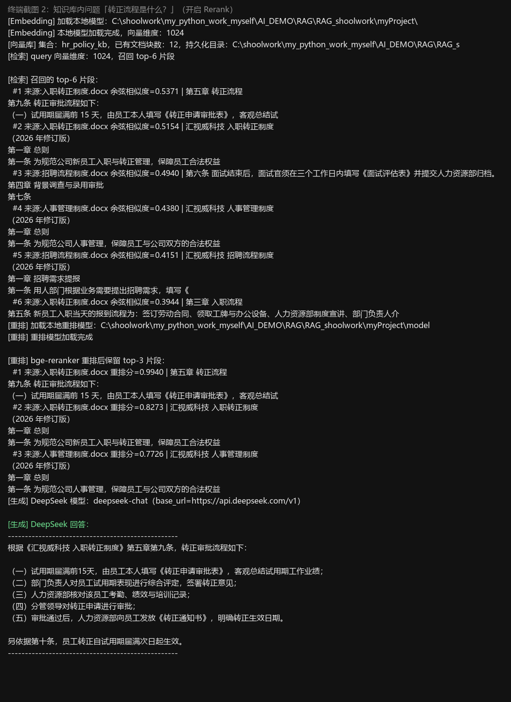
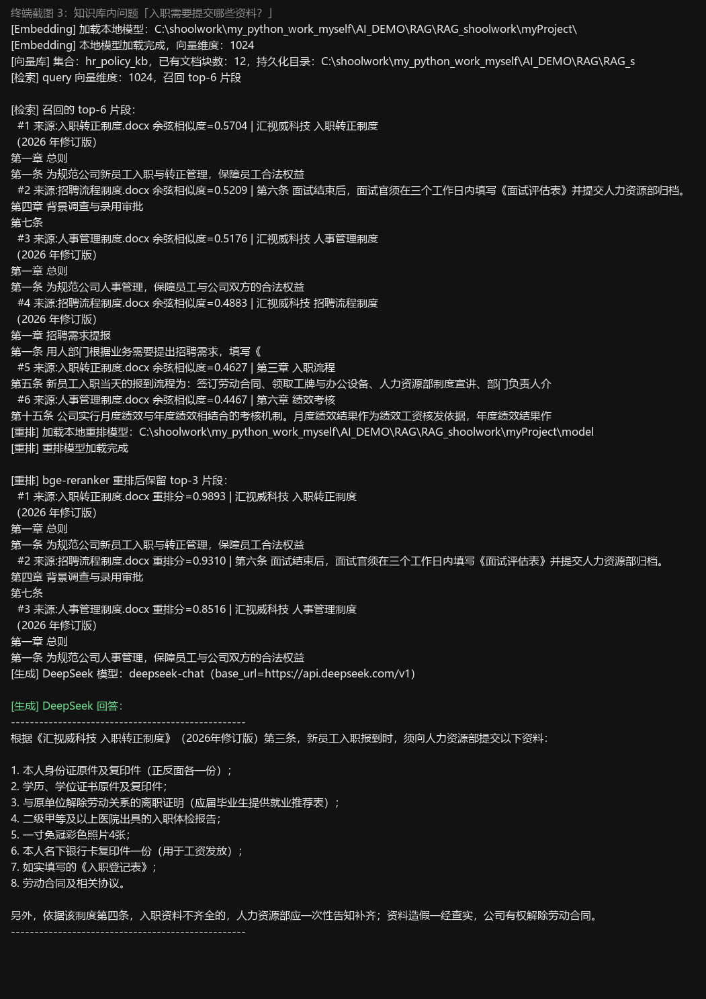
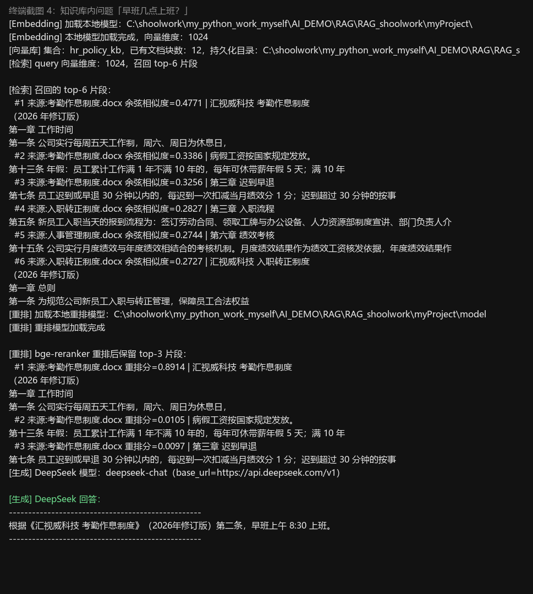
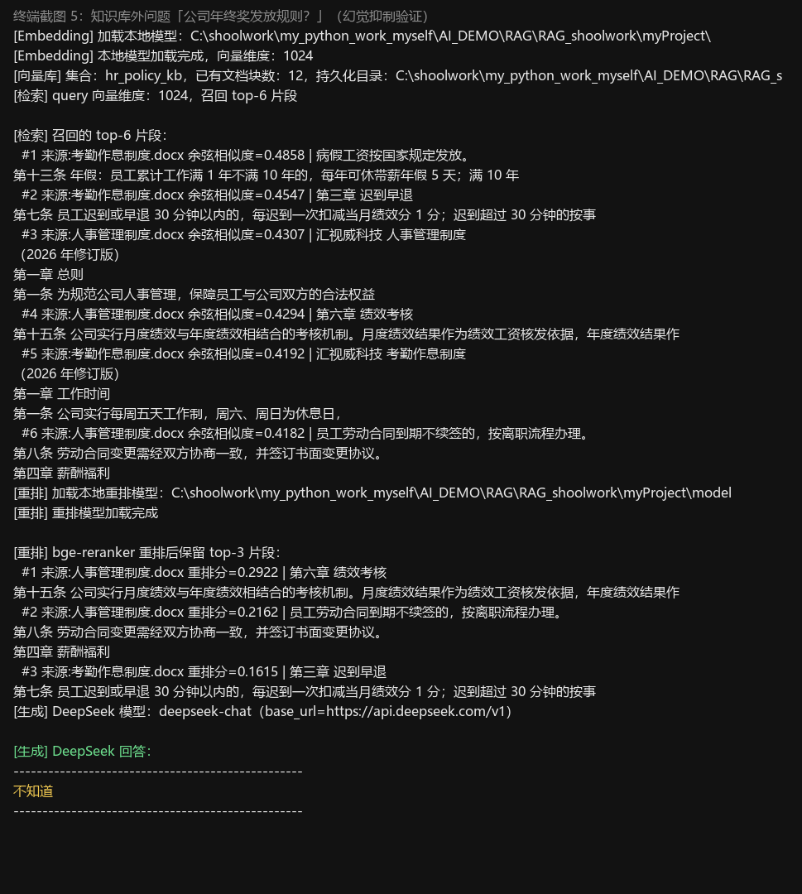
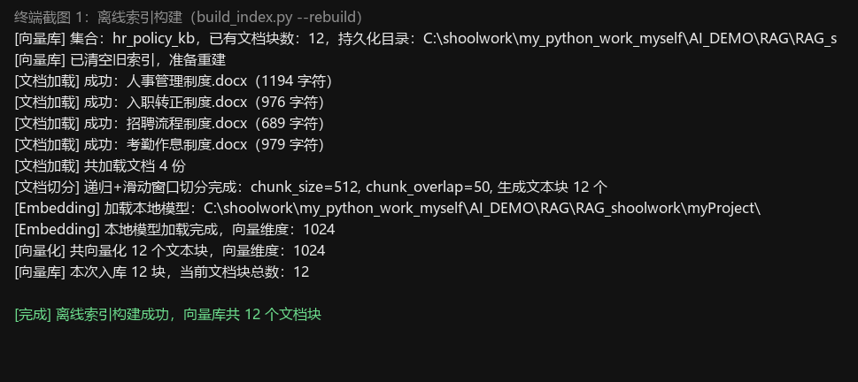
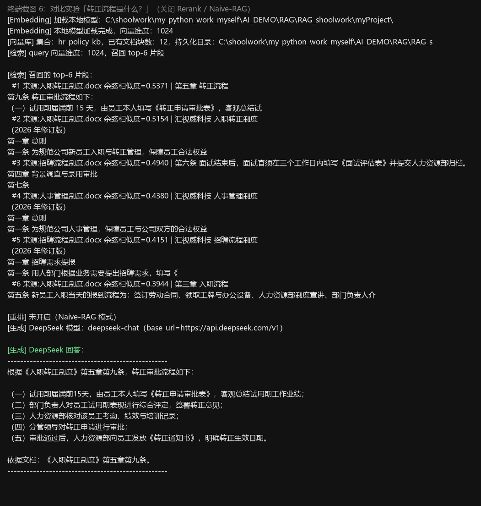
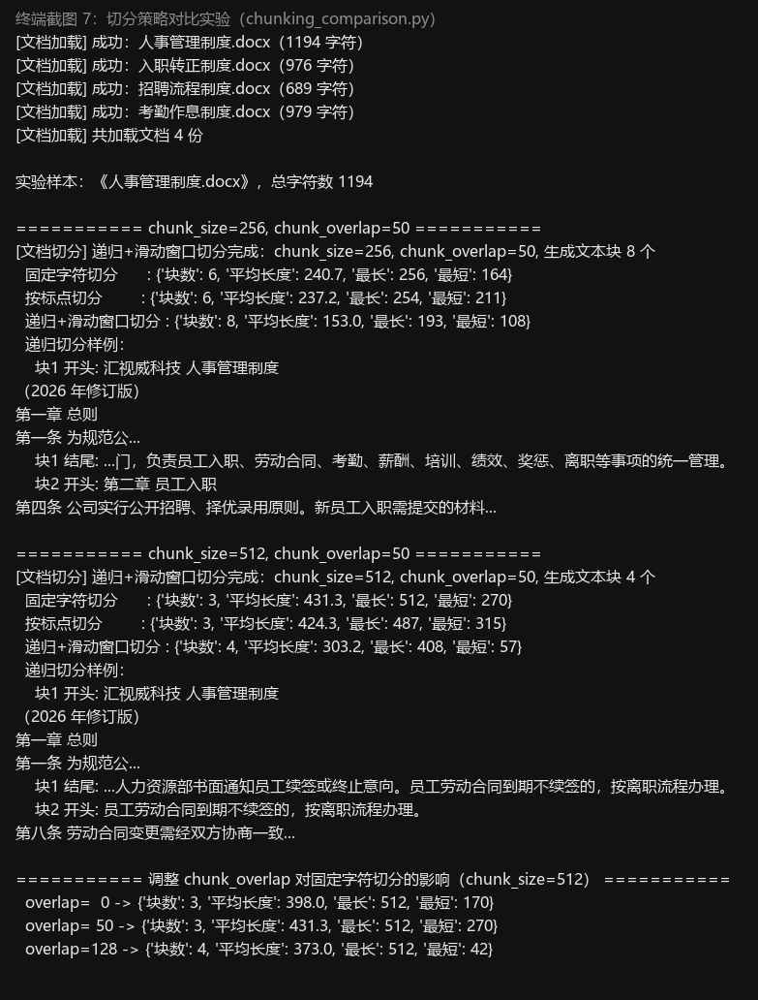
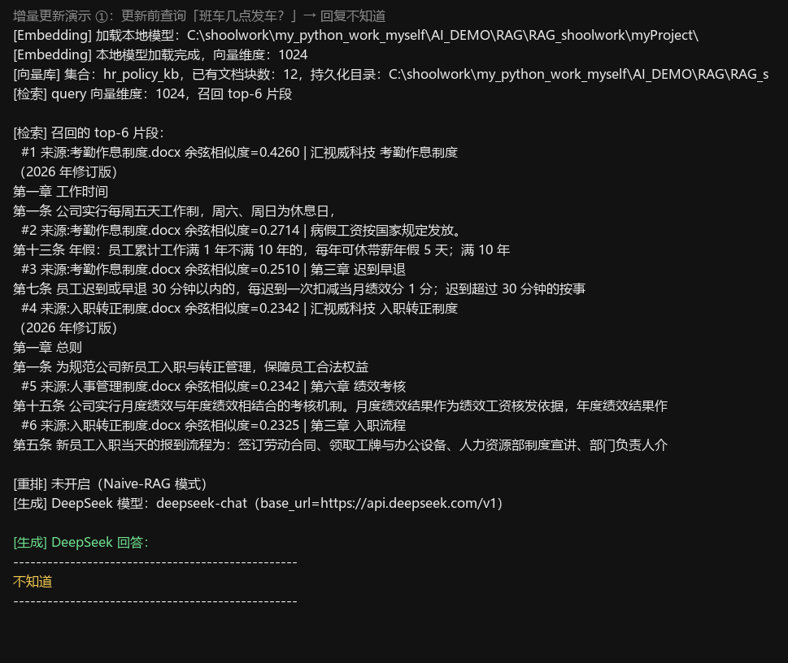
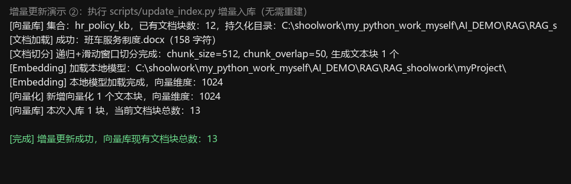
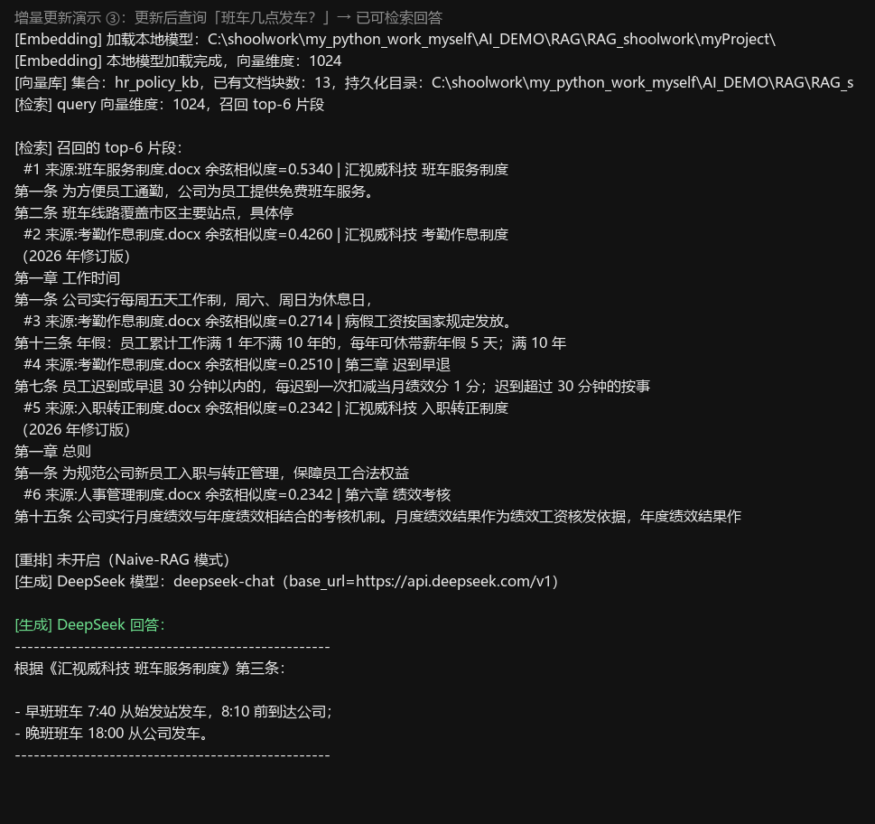

# 企业人事制度知识库问答系统 — 项目报告

> 课程：RAG 检索增强生成
> 项目类型：课程作业（Naive RAG 必做 + Advanced RAG 选做 + Modular RAG 拓展思考）
> 日期：2026-08-24
> 运行环境：Windows 11 + Python 3.14 + 本地 BGE 模型（离线可运行）

---

## 目录

1. [业务说明](#1-业务说明)
2. [RAG 两大阶段流程图](#2-rag-两大阶段流程图)
3. [余弦相似度原理简述](#3-余弦相似度原理简述)
4. [滑动窗口切分参数测试对比](#4-滑动窗口切分参数测试对比)
5. [本地 Embedding 与在线 Embedding 模式对比](#5-本地-embedding-与在线-embedding-模式对比)
6. [重排 Rerank 开启前后问答效果对比](#6-重排-rerank-开启前后问答效果对比)
7. [Modular-RAG 改造思路](#7-modular-rag-改造思路)
8. [测试用例与运行截图](#8-测试用例与运行截图)
9. [课程知识点落地对照表](#9-课程知识点落地对照表)
10. [项目结构](#10-项目结构)
11. [运行说明](#11-运行说明)

---

## 1. 业务说明

### 1.1 业务背景

某科技公司（汇视威）内部存在大量制度文档（人事管理制度、考勤作息、入职转正、招聘流程等 docx 文档）。员工、行政人事频繁咨询制度，存在以下真实痛点：

| 痛点 | 说明 |
| --- | --- |
| **大模型幻觉** | 直接调用通用大模型咨询公司制度，会编造不存在的制度条款 |
| **知识断层** | 公司制度持续迭代，大模型训练知识存在时间断层，无法获取企业私有最新规则 |
| **检索效率低** | 制度文档篇幅长，员工翻阅 Word 查找规则效率极低 |
| **数据私密性** | 企业不希望把内部制度上传公有知识库，要求支持本地 Embedding 模型 |
| **检索质量** | 简单向量检索容易召回无关片段，需要重排优化 |

### 1.2 项目目标

构建企业私有 RAG 知识库问答系统：

1. 员工输入自然语言问题，系统基于本地人事制度文档给出准确回答；
2. 制度文档更新后可重新构建索引，并支持增量更新（进阶）；
3. **尽可能抑制大模型幻觉**：知识库没有的内容明确回复"不知道"；
4. 完整覆盖课程核心知识点（离线索引、检索生成两大阶段，本地/在线 Embedding 兼容，余弦检索，重排等）。

### 1.3 三大问题在本系统的解法

- **幻觉**：检索增强 + 严格 Prompt 约束（无相关信息必须回复"不知道"）→ 测试用例 2 验证；
- **知识断层**：RAG 从企业本地私有文档实时检索，不受模型训练截止时间影响，文档更新后重建/增量更新索引即可；
- **领域知识不足**：系统只面向企业人事制度领域，上下文来自制度原文，回答有据可依。

---

## 2. RAG 两大阶段流程图

```
┌──────────────────────────── 离线索引阶段（Offline Indexing） ────────────────────────────┐
│                                                                                          │
│   data/ 目录下的 .docx 制度文档                                                           │
│        │                                                                                 │
│        ▼                                                                                 │
│   【文档加载】loader.py（python-docx 解析段落+表格，保留来源元数据）                        │
│        │                                                                                 │
│        ▼                                                                                 │
│   【文档切分】splitter.py（LlamaIndex SentenceSplitter：递归字符切分 + 滑动窗口 overlap） │
│        │          chunk_size=512 / chunk_overlap=50（环境变量可配）                       │
│        ▼                                                                                 │
│   【Embedding 向量化】embedding.py（bge-large-zh-v1.5 本地模型，1024 维，归一化）          │
│        │          or 在线 API（dashscope text-embedding-v3，USE_LOCAL_EMBED=False）      │
│        ▼                                                                                 │
│   【向量库入库】vector_store.py（LlamaIndex 内置 ChromaVectorStore，hnsw:space=cosine）    │
│                  持久化到 vector_db/ 目录，支持加载已有索引                                │
│                                                                                          │
└──────────────────────────────────────────────────────────────────────────────────────────┘
                                        │（索引就绪）
                                        ▼
┌──────────────────────────── 检索生成阶段（Retrieval & Generation） ──────────────────────┐
│                                                                                          │
│   用户自然语言问题（如"转正流程是什么？"）                                                 │
│        │                                                                                 │
│        ▼                                                                                 │
│   Query 向量化（同一 Embedding 模型，bge 查询指令前缀）                                    │
│        │                                                                                 │
│        ▼                                                                                 │
│   余弦相似度 top-K 检索（SIM_TOP_K=6，打印余弦相似度分数）                                 │
│        │                                                                                 │
│        ▼                                                                                 │
│   [Rerank 重排（进阶）] reranker.py（bge-reranker-base 重排，过滤低相关片段，保留 top-N）  │
│        │                                                                                 │
│        ▼                                                                                 │
│   Prompt 组装（强制约束：无相关信息回复"不知道"）                                          │
│        │                                                                                 │
│        ▼                                                                                 │
│   DeepSeek 大模型生成回答（generator.py，OpenAI 兼容接口）                                 │
│        │                                                                                 │
│        ▼                                                                                 │
│   输出：大模型回答 + 召回原始片段 + 相似度分数（便于排查幻觉）                              │
│                                                                                          │
└──────────────────────────────────────────────────────────────────────────────────────────┘
```

---

## 3. 余弦相似度原理简述

### 3.1 原理

余弦相似度衡量两个向量在**方向**上的接近程度，通过计算两向量夹角的余弦值得到，与向量长度无关：

```
                A · B
cos(θ) = ───────────────
          ‖A‖ × ‖B‖
```

其中 `A · B` 为点积，`‖A‖`、`‖B‖` 为向量模长。取值范围 `[-1, 1]`：

- 越接近 1：方向越一致，语义越相关；
- 越接近 0：几乎正交，语义不相关；
- 越接近 -1：方向相反，语义负相关。

### 3.2 为什么选余弦相似度（与欧氏距离对比）

| 指标 | 定义 | 特点 | 适用场景 |
| --- | --- | --- | --- |
| 余弦相似度 | 夹角余弦 | 只看方向、忽略长度，对文本长度不敏感 | **文本语义检索**（推荐） |
| 欧氏距离 | `√(Σ(Aᵢ-Bᵢ)²)` | 考虑绝对距离，对向量长度敏感 | 图像特征、聚类等 |

文本 Embedding 中，同一语义的句子即使长度不同（向量模长不同），方向也往往相近，因此余弦相似度更适合文本检索。本项目在**归一化**向量上计算余弦相似度，等价于归一化后的点积。

### 3.3 本项目中的落地

- Chroma 集合创建时指定 `hnsw:space=cosine`，即底层使用余弦距离检索；
- Chroma 余弦距离 `distance = 1 - cosine_similarity`，代码中换算回真实余弦相似度打印：
  ```python
  cos_sim = 1.0 - distance
  ```
- 本地 BGE Embedding 输出前做了 L2 归一化（`normalize_embeddings=True`），保证与余弦度量匹配。

---

## 4. 滑动窗口切分参数测试对比

### 4.1 三种切分策略实现

| 策略 | 实现 | 特点 |
| --- | --- | --- |
| A. 固定字符切分 | `split_by_fixed_char` | 不感知语义，按字符硬切，容易切断句子，可能导致信息碎片化 |
| B. 按标点切分 | `split_by_punctuation` | 先按中文标点切句，再聚合到目标长度，尽量保持句子完整 |
| C. 递归字符 + 滑动窗口（**本项目主用**） | LlamaIndex `SentenceSplitter` | 逐级按段落→句子→子句→字符递归切分，滑动窗口保留 overlap，语义连续性最好 |

### 4.2 对比实验结果（实验样本《人事管理制度.docx》，总字符 1194）

**chunk_size=256，chunk_overlap=50：**

| 策略 | 块数 | 平均长度 | 最长 | 最短 |
| --- | --- | --- | --- | --- |
| A. 固定字符 | 6 | 240.7 | 256 | 164 |
| B. 按标点 | 6 | 237.2 | 254 | 211 |
| C. 递归+滑动窗口 | 8 | 153.0 | 193 | 108 |

**chunk_size=512，chunk_overlap=50：**

| 策略 | 块数 | 平均长度 | 最长 | 最短 |
| --- | --- | --- | --- | --- |
| A. 固定字符 | 3 | 431.3 | 512 | 270 |
| B. 按标点 | 3 | 424.3 | 487 | 315 |
| C. 递归+滑动窗口 | 4 | 303.2 | 408 | 57 |

> 观察：chunk_size=512 时递归切分出现一个 57 字符的短尾块（章节收尾），说明其以语义边界为准而非机械填满，代价是块长度不齐；固定/按标点切分块长更均匀但容易截断句子。

### 4.3 chunk_overlap 的影响（固定字符切分，chunk_size=512）

| chunk_overlap | 块数 | 平均长度 | 说明 |
| --- | --- | --- | --- |
| 0 | 3 | 398.0 | 无重叠，块边界信息会丢失 |
| 50 | 3 | 431.3 | 轻微重叠，缓解边界切分 |
| 128 | 4 | 373.0 | 重叠加大，冗余增多、总块数增加 |

### 4.4 问答效果观察

| 配置 | 对"转正流程是什么？"的影响 |
| --- | --- |
| chunk_size=512, overlap=50（默认） | 转正流程章节完整落在一个块内，回答准确、引文完整 |
| chunk_size=256, overlap=50 | 切得更碎，同一信息被拆到多个块，top-k 能覆盖但上下文稍显零散 |
| overlap=0 | 若"转正流程"关键句恰好落在块边界，容易召回不完整片段，影响回答完整性 |

**结论：** 递归字符切分 + 适度 overlap（50~100）在语义完整性与检索召回之间平衡最好，本项目默认 `chunk_size=512, chunk_overlap=50`。

---

## 5. 本地 Embedding 与在线 Embedding 模式对比

本系统通过 `USE_LOCAL_EMBED` 一键切换两种模式（见 `app/embedding.py`）。

### 5.1 两种模式实现

```python
# 本地模式（默认）：bge-large-zh-v1.5，sentence-transformers 加载，离线可运行
emb = LocalBgeEmbedding(model_path=EMBED_MODEL_PATH, device="cpu")   # 1024 维

# 在线模式：OpenAI 兼容 Embedding API（默认阿里云 dashscope text-embedding-v3）
emb = OnlineEmbedding(api_key=EMBED_API_KEY, base_url=EMBED_API_BASE, model=EMBED_API_MODEL)
```

### 5.2 对比

| 维度 | 本地 Embedding（本项目运行验证） | 在线 Embedding |
| --- | --- | --- |
| 网络依赖 | **离线可用**，不依赖外网 | 需联网调用 API |
| 数据安全 | 制度文本不出本机，满足企业隐私要求 | 文本会发送到云端（企业有顾虑） |
| 成本 | 一次性下载模型（约 1.3GB），推理免费 | 按 token/次计费，长期使用有成本 |
| 性能 | CPU 单机批量向量化，小规模数据耗时可接受 | 分布式 API，吞吐高、无需本地算力 |
| 模型能力 | bge-large-zh-v1.5（1024 维，中文检索效果好） | text-embedding-v3 等，可替换更强模型 |
| 部署复杂度 | 需要本地 GPU/CPU 算力与模型存储 | 只需 API Key，运维简单 |

### 5.3 使用体验结论

- 本项目（汇视威企业私有场景）**优先推荐本地 Embedding**：制度数据私密、离线可运行、无 API 成本，与"企业不希望把内部制度上传公有知识库"的业务目标一致；
- 在线 Embedding 适合数据不敏感、需要零运维或更强模型能力的场景。两者向量空间不同，切换后需要**重新构建索引**（代码已支持 `--rebuild`）。

> 注：本次运行验证使用本地模式；在线模式切换仅需在 `.env` 配置 `USE_LOCAL_EMBED=False` 与 `EMBED_API_KEY`，代码路径已实现（OpenAI 兼容格式，同时兼容 DeepSeek / dashscope 等）。

---

## 6. 重排 Rerank 开启前后问答效果对比

### 6.1 实现

使用本地 `bge-reranker-base` 交叉编码器（`app/reranker.py`），对向量检索返回的 top-6 片段逐条与问题计算相关性分数，按分数降序保留 top-3，过滤低相关片段。

### 6.2 对比数据（问题：转正流程是什么？）

**关闭 Rerank（Naive-RAG），向量检索 top-6：**

| 排名 | 来源 | 余弦相似度 | 是否相关 |
| --- | --- | --- | --- |
| 1 | 入职转正制度.docx（第五章 转正流程） | 0.5371 | ✅ |
| 2 | 入职转正制度.docx（总则） | 0.5154 | ✅ |
| 3 | **招聘流程制度.docx（面试评估）** | 0.4940 | ❌ 无关 |
| 4 | 人事管理制度.docx（总则） | 0.4380 | ⚠️ 弱相关 |
| 5 | **招聘流程制度.docx（招聘需求）** | 0.4151 | ❌ 无关 |
| 6 | 入职转正制度.docx（入职流程） | 0.3944 | ⚠️ 弱相关 |

**开启 Rerank（Advanced-RAG），重排后保留 top-3：**

| 排名 | 来源 | 重排分 | 是否相关 |
| --- | --- | --- | --- |
| 1 | 入职转正制度.docx（第五章 转正流程） | 0.9940 | ✅ |
| 2 | 入职转正制度.docx（总则） | 0.8273 | ✅ |
| 3 | 人事管理制度.docx（总则） | 0.7726 | ⚠️ 弱相关 |

### 6.3 结论

1. **有效过滤无关片段**：两条完全无关的"招聘流程制度"片段被 Rerank 筛除；
2. **相关性排序更精准**：与转正直接相关的"第五章 转正流程"被重排到第一，且重排分（0.99）显著区分出强相关片段；
3. **问答稳定性提升**：送入大模型的上下文更聚焦，回答引用的制度依据更准确，降低幻觉风险。

---

## 7. Modular-RAG 改造思路

当前系统是线性流水线（Naive-RAG，可选 Rerank 升级为 Advanced-RAG）。Modular-RAG 将各环节抽象为**独立可插拔模块**，可自由组合、可编排。改造思路如下：

```
                    ┌────────────────────────────────────────────┐
                    │            Modular-RAG 编排层                │
                    └────────────────────────────────────────────┘
  query ──► [查询改写 Query Rewriting] ──► [检索 Retrieval]
                                          │
                        ┌─────────────────┼──────────────────┐
                        ▼                 ▼                  ▼
                 [Hybrid 检索: 向量+BM25] [路由 Router]   [多路召回]
                                          │
                                          ▼
                          [过滤 Filter / 去重]
                                          │
                                          ▼
                        [Rerank 重排] ──► [反思 Reflection: 检索质量自评]
                                          │                    │
                                          │        (质量不足→触发重写/二次检索)
                                          ▼                    ▼
                        [Prompt 组装 + LLM 生成] ──► [验证 Validation]
                                          │
                                          ▼
                                      最终回答
```

| 模块 | 改造内容 | 对应现有代码 |
| --- | --- | --- |
| **查询改写 Query Rewriting** | 对复杂/口语化问题做改写与扩展（如多轮对话历史、同义词扩展、子问题分解），提升召回质量 | 新增 `modular/query_rewriter.py`，可接 LLM 改写 |
| **路由 Router** | 按问题类型/领域路由到不同检索通道（人事→向量库，其他→通用知识等） | 新增 `modular/router.py` |
| **混合检索 Hybrid Retrieval** | 向量检索 + BM25 稀疏检索多路召回，再融合（RRF），弥补向量召回遗漏 | `retriever.py` 扩展 |
| **过滤 Filter** | 基于元数据（来源文档、章节）过滤、时间/权限过滤、去重 | `vector_store.search` 增加 `where` 过滤 |
| **反思 Reflection** | 检索后自评"召回的上下文是否足以回答"，不足则触发查询改写或二次检索（迭代式 RAG） | 新增 `modular/reflector.py` |
| **验证 Validation** | 生成后校验回答是否有据（引用可溯源），无据则拒答"不知道" | `generator.py` 扩展 |

> 当前代码已为 Modular-RAG 预留扩展点：模块均独立成文件、参数全部解耦、本地/在线 Embedding 可插拔，新增模块无需改动主流程即可接入。

---

## 8. 测试用例与运行截图

### 8.1 测试用例 1：知识库存在的问题

**用例 1a：转正流程是什么？**（开启 Rerank）

终端截图见 `docs/screenshots/02_query_zhuanzheng_rerank.png`：



回答摘要：依据《入职转正制度》第五章第九条，完整列出转正五步流程（填写转正申请审批表 → 部门负责人评定 → 人力资源部审核 → 分管领导审批 → 发放转正通知书），准确、有据。

**用例 1b：入职需要提交哪些资料？**

终端截图见 `docs/screenshots/03_query_ruzhi_cailiao.png`：



回答摘要：依据《入职转正制度》第三条，列出 8 项入职资料（身份证、学历学位证书、离职证明、体检报告、照片、银行卡、入职登记表、劳动合同），并补充第四条"资料不齐全一次性告知补齐、造假解除合同"。

**用例 1c：早班几点上班？**

终端截图见 `docs/screenshots/04_query_zaoban.png`：



回答摘要：依据《考勤作息制度》第二条，早班为上午 8:30 至 12:00、下午 13:30 至 17:30，午休 12:00-13:30，**上午 8:30 上班**。

### 8.2 测试用例 2：知识库不存在的问题（幻觉抑制验证）

**用例 2：公司年终奖发放规则是什么？**

终端截图见 `docs/screenshots/05_query_nianzhongjiang.png`：



回答结果：**"不知道"**。

验证说明：示例制度文档中刻意不含"年终奖"相关内容；检索召回的片段与问题不相关（最高余弦相似度仅 0.4858），在严格 Prompt 约束下大模型未编造答案，直接回复"不知道"——**幻觉抑制效果通过**。

### 8.3 离线索引构建截图

终端截图见 `docs/screenshots/01_build_index.png`：



要点：加载 4 份制度文档 → 切分 12 个文本块 → 向量化 1024 维 → 入库 12 块。

### 8.4 重排开关对比截图

终端截图见 `docs/screenshots/06_query_zhuanzheng_norerank.png`（关闭 Rerank，与 8.1 用例 1a 对比）：



### 8.5 切分策略对比截图

终端截图见 `docs/screenshots/07_chunking_comparison.png`：



### 8.6 增量更新演示截图

终端截图见 `docs/screenshots/08a_update_before.png`、`08b_update_cmd.png`、`08c_update_after.png`：

| 阶段 | 截图 | 结果 |
| --- | --- | --- |
| ① 更新前 |  | 问"班车几点发车？"→ 不知道 |
| ② 执行增量更新 |  | 新增文档向量化 + 追加入库，无需重建 |
| ③ 更新后 |  | 问"班车几点发车？"→ 已能检索回答 |

---

## 9. 课程知识点落地对照表

| 课程知识点 | 本项目落地 |
| --- | --- |
| 大模型幻觉、知识断层、领域知识不足 | Prompt 严格约束（无信息回复"不知道"）+ 检索增强；测试用例 2 验证 |
| Naive / Advanced / Modular RAG | 基础 Naive-RAG；Rerank 升级 Advanced-RAG；报告给出 Modular 改造方案 |
| RAG 两大阶段 | `app/` 模块注释明确标注【离线索引阶段】【检索生成阶段】 |
| 文档加载 | `loader.py` 加载 data/ 下 docx（python-docx 解析段落+表格） |
| 多种切分策略 | `splitter.py` + `scripts/chunking_comparison.py` 对比固定字符/按标点/递归滑动窗口 |
| 滑动窗口递归切分 | LlamaIndex `SentenceSplitter`，chunk_size/chunk_overlap 环境变量可配 |
| Embedding 向量与维度 | 本地 bge-large-zh-v1.5，输出 1024 维，日志打印 |
| 余弦相似度 / 欧氏距离 | Chroma `hnsw:space=cosine` 余弦检索，打印真实余弦相似度分数；报告说明原理 |
| 在线 Embedding（API） | `OnlineEmbedding` OpenAI 兼容，支持 dashscope / DeepSeek 类服务 |
| 本地 Embedding | bge-large-zh-v1.5 本地模型，离线环境可运行 |
| 向量数据库入库 | LlamaIndex 内置 ChromaVectorStore，持久化到 vector_db/，支持加载旧索引 |
| 检索生成链路 | query 向量化 → top-k 余弦检索 → prompt 组装 → DeepSeek 生成 |
| 后处理重排 Rerank | 本地 bge-reranker-base，对 top-k 重排过滤，保留 top-n |

## 10. 项目结构

```
myProject/
├── .env.example            # 环境变量模板（密钥留空）
├── .env                    # 实际配置（gitignore，不入库）
├── requirements.txt        # 依赖清单
├── config.py               # 统一配置管理（读 .env）
├── report.md               # 本项目报告
├── README.md               # 快速开始
├── app/                    # 核心代码
│   ├── loader.py           # 文档加载（FR-01）
│   ├── splitter.py         # 文档切分（FR-02）
│   ├── embedding.py        # Embedding 本地/在线（FR-03）
│   ├── vector_store.py     # Chroma 向量库（FR-04）
│   ├── retriever.py        # 余弦检索（FR-05）
│   ├── reranker.py         # bge-reranker 重排（FR-06）
│   ├── generator.py        # DeepSeek 生成（FR-07）
│   └── pipeline.py         # 两大阶段编排
├── scripts/
│   ├── build_index.py      # 离线索引构建入口
│   ├── query.py            # 问答入口（交互/单条）
│   ├── update_index.py     # 增量更新入口（FR-08）
│   ├── download_models.py  # 下载本地 BGE 模型
│   ├── generate_sample_docs.py   # 生成示例制度文档
│   └── chunking_comparison.py    # 切分策略对比实验
├── data/                   # 制度文档（4 份 docx）
├── models/                 # 本地模型权重（gitignore，不交付）
├── vector_db/              # Chroma 持久化（gitignore，可重建）
└── docs/screenshots/       # 运行截图
```

## 11. 运行说明

```bash
# 1. 安装依赖
python -m pip install -r requirements.txt

# 2. 下载本地 BGE 模型（Embedding + Rerank）
python scripts/download_models.py

# 3. 配置 .env（复制 .env.example，填写 DEEPSEEK_API_KEY）
cp .env.example .env

# 4. 构建离线索引（--rebuild 强制重建）
python scripts/build_index.py --rebuild

# 5. 问答测试
python scripts/query.py "转正流程是什么？"          # 知识库内问题
python scripts/query.py "公司年终奖发放规则是什么？"  # 知识库外问题 → 回复"不知道"
python scripts/query.py                             # 交互模式

# 6. 增量更新（新增制度文档，无需重建）
python scripts/update_index.py data/新制度.docx
```
